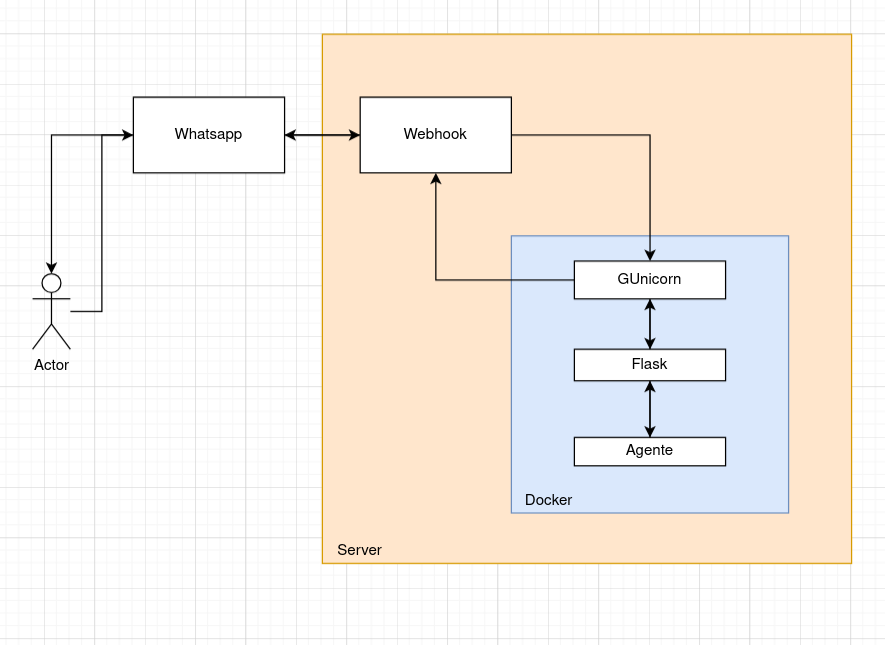
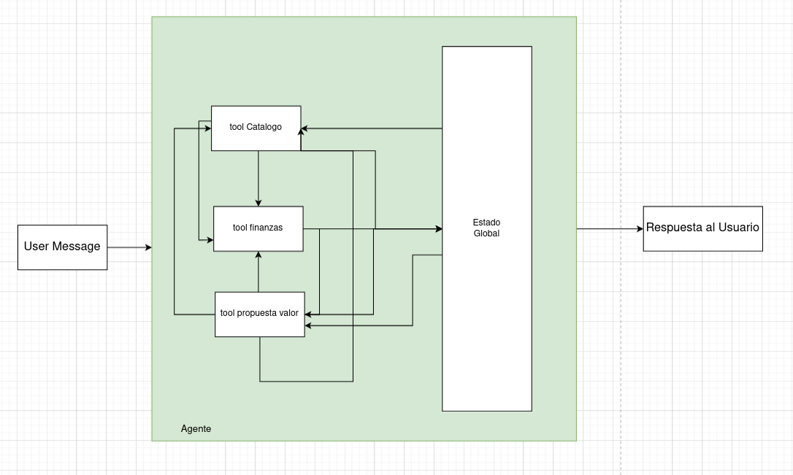
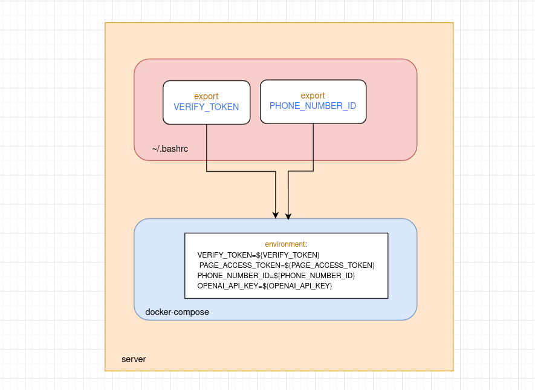

# 🤖 Bot Demostrativo para Atención al Cliente - Kavak

Agente conversacional inteligente de atención al cliente construido sobre Flask como framework web y LangChain como orquestador de herramientas especializadas con OpenAI GPT-3.5-turbo. Se despliega a través de WhatsApp Business API implementando gestión de estados multiusuario y proporciona tres capacidades de negocio: consulta de información sobre Kavak, motor de búsqueda con filtros automáticos en catálogo de vehículos, y calculadora de planes de financiamiento con tasa fija del 10% anual.

## 🏗️ Arquitectura del Sistema

### Arquitectura General del Servicio



La arquitectura muestra la integración completa entre WhatsApp Business API, el servidor Flask con Docker, y el agente inteligente con sus herramientas especializadas.

### Flujo del Agente Inteligente



El diagrama ilustra cómo el agente procesa los mensajes del usuario, mantiene el estado global, y utiliza las tres tools especializadas para generar respuestas contextualmente relevantes.

### Arquitectura de Seguridad - Variables de Entorno



Implementación de seguridad de nivel enterprise para la gestión de variables de entorno, separando configuración del código fuente y asegurando que los secretos solo existan en memoria del sistema.

## ✨ Características Principales

### 🛡️ **Seguridad y Configuración**
- Variables de entorno gestionadas a nivel de sistema operativo
- Sin archivos con secretos en el código fuente
- Configuración de producción con Docker
- Logging estructurado y profesional

### 🧠 **Agente Inteligente**
- **LangChain Agent** con OpenAI GPT-3.5-turbo
- **Gestión de estado multiusuario** independiente por número de teléfono
- **3 Tools especializadas** para diferentes tipos de consultas
- **Detección automática** del contexto de conversación

### 📱 **Integración WhatsApp**
- WhatsApp Business API completamente integrada
- Manejo de webhooks entrantes y salientes
- Confirmación de entrega de mensajes

### 🚗 **Funcionalidades de Negocio**
- **Información de Kavak**: Sedes, beneficios, proceso de compra
- **Catálogo de vehículos**: Búsqueda inteligente con filtros automáticos
- **Calculadora de financiamiento**: Planes personalizados con tasa fija del 10%

## 🗂️ Estructura del Proyecto

```
botAtencionClientes/
├── app.py                      # Aplicación Flask principal y endpoints
├── agent.py                    # Agente LangChain y tools especializadas  
├── estado_global.py            # Gestión de estados multiusuario
├── catalogo_autos.py           # Motor de búsqueda de vehículos
├── financiamiento.py           # Calculadora de planes de pago
├── conocimiento_kavak.py       # Base de conocimiento de la empresa
├── sample_caso_ai_engineer.csv # Catálogo de vehículos disponibles
├── docker-compose.yml          # Configuración de contenedores
├── Dockerfile                  # Imagen del bot
├── requirements.txt            # Dependencias de Python
└── wsgi.py                     # Configuración WSGI para producción
```

## 🚀 Instalación y Configuración

### Prerrequisitos

- Docker y Docker Compose
- Cuenta de WhatsApp Business API
- API Key de OpenAI
- Servidor con Ubuntu (recomendado)

### 1. Clonar el Repositorio

```bash
git clone <tu-repositorio>
cd botAtencionClientes
```

### 2. Configurar Variables de Entorno

En tu servidor, agregar las variables al perfil del usuario:

```bash
# Editar ~/.bashrc
nano ~/.bashrc

# Agregar al final del archivo:
export VERIFY_TOKEN="tu_token_de_verificacion"
export PAGE_ACCESS_TOKEN="tu_token_de_whatsapp_business"  
export PHONE_NUMBER_ID="tu_phone_number_id"
export OPENAI_API_KEY="tu_openai_api_key"

# Recargar variables
source ~/.bashrc

# Verificar configuración
echo $VERIFY_TOKEN
echo $PAGE_ACCESS_TOKEN
```

### 3. Construir y Ejecutar

```bash
# Construir e iniciar el servicio
docker-compose up --build

# Para ejecutar en segundo plano
docker-compose up -d --build
```

### 4. Verificar el Servicio

```bash
# Comprobar que el servicio esté funcionando
curl http://localhost:5000/health

# Ver logs en tiempo real
docker-compose logs -f bot
```

## 📋 Variables de Entorno Requeridas

Crea un archivo `.env` solo para desarrollo local (NO subir a producción):

```bash
# Token de verificación para Facebook (úsalo en la configuración del webhook)
VERIFY_TOKEN=tu_token_de_verificacion

# Token de acceso de tu página de Facebook (lo obtienes de Facebook Developers)
PAGE_ACCESS_TOKEN=tu_token_de_whatsapp_business

# OpenAI API Key (para el modelo GPT-3.5-turbo)
OPENAI_API_KEY=tu_openai_api_key

# Phone Number ID de WhatsApp Business
PHONE_NUMBER_ID=tu_phone_number_id
```

## 🔗 API Endpoints

### Endpoints Principales

| Endpoint | Método | Descripción |
|----------|--------|-------------|
| `/` | GET | Página de inicio |
| `/webhook` | GET | Verificación de webhook WhatsApp |
| `/webhook` | POST | Recepción de mensajes WhatsApp |
| `/health` | GET | Health check del servicio |

### Endpoints de Administración

| Endpoint | Método | Descripción |
|----------|--------|-------------|
| `/estado/<telefono>` | GET | Estado actual de un usuario |
| `/reiniciar/<telefono>` | POST | Reiniciar conversación de usuario |
| `/resumen-general` | GET | Resumen de todos los usuarios activos |
| `/usuarios-activos` | GET | Lista de usuarios con conversaciones activas |
| `/eliminar-usuario/<telefono>` | DELETE | Eliminar usuario del sistema |
| `/limpiar-inactivos` | POST | Limpiar usuarios inactivos |
| `/historial/<telefono>` | GET | Historial completo de acciones de un usuario |
| `/test-agente` | POST | Endpoint de prueba del agente |

### Ejemplos de Uso

**Health Check:**
```bash
curl http://localhost:5000/health
```

**Estado de Usuario:**
```bash
curl http://localhost:5000/estado/5215519118275
```

**Historial de Usuario:**
```bash
curl http://localhost:5000/historial/5215519118275
```

**Prueba del Agente:**
```bash
curl -X POST http://localhost:5000/test-agente \
  -H "Content-Type: application/json" \
  -d '{
    "mensaje": "Quiero información sobre autos Toyota",
    "telefono": "5215519118275"
  }'
```

## 💬 Ejemplos de Conversación

### Información General
```
Usuario: "Hola, ¿qué es Kavak?"
Bot: Información completa sobre la empresa, sedes, beneficios...

Usuario: "¿Dónde tienen sedes en CDMX?"
Bot: Lista detallada de todas las sedes en Ciudad de México...
```

### Búsqueda de Autos
```
Usuario: "Quiero un Toyota del 2020"
Bot: Lista de autos Toyota 2020 disponibles con precios y características...

Usuario: "Muéstrame el segundo auto"
Bot: Información detallada del Toyota específico seleccionado...
```

### Financiamiento
```
Usuario: "¿Cómo puedo financiar el Toyota?"
Bot: Opciones de financiamiento con diferentes enganches y plazos...

Usuario: "Con enganche de 50000 a 4 años"
Bot: Plan específico calculado con pago mensual exacto...
```

## 🛠️ Tecnologías Utilizadas

### Backend
- **Flask 2.3.3** - Framework web
- **LangChain 0.1.0** - Framework para aplicaciones LLM
- **OpenAI GPT-3.5-turbo** - Modelo de lenguaje
- **Pandas** - Procesamiento de datos del catálogo
- **Pydantic 2.5.3** - Validación de datos

### Infraestructura
- **Docker** - Contenedorización
- **Gunicorn 21.2.0** - Servidor WSGI de producción
- **Ubuntu Server** - Sistema operativo
- **WhatsApp Business API** - Integración de mensajería

### Herramientas
- **Requests 2.31.0** - Cliente HTTP
- **Logging** - Sistema de logs estructurados

## 📊 Monitoreo y Logs

### Estructura de Logs

```
2025-08-22 22:42:00,139 - app - INFO - Mensaje de 5215519118275: Hola
2025-08-22 22:42:00,140 - agent - INFO - Procesando mensaje: Hola
2025-08-22 22:42:00,140 - agent - INFO - Tools disponibles: ['propuesta_valor', 'catalogo_autos', 'planes_financiamiento']
2025-08-22 22:42:01,383 - app - INFO - WhatsApp mensaje enviado exitosamente a 5215519118275
```

### Comandos de Monitoreo

```bash
# Ver logs en tiempo real
docker-compose logs -f bot

# Ver solo errores
docker-compose logs bot | grep ERROR

# Ver logs de un período específico
docker-compose logs --since="2025-08-22T22:00:00" bot
```

## 🔧 Troubleshooting

### Problemas Comunes

**1. Variables de entorno no configuradas:**
```bash
# Verificar que estén cargadas
echo $VERIFY_TOKEN
echo $PAGE_ACCESS_TOKEN

# Si no aparecen, recargar
source ~/.bashrc
```

**2. Contenedor no inicia:**
```bash
# Ver logs de error
docker-compose logs bot

# Reconstruir imagen
docker-compose down
docker-compose up --build
```

**3. Webhook no recibe mensajes:**
- Verificar que el VERIFY_TOKEN coincida con WhatsApp Business
- Comprobar que el endpoint `/webhook` sea accesible públicamente
- Validar el PAGE_ACCESS_TOKEN en Facebook Developers

**4. Agente no responde correctamente:**
```bash
# Probar endpoint de testing
curl -X POST http://localhost:5000/test-agente \
  -H "Content-Type: application/json" \
  -d '{"mensaje": "test", "telefono": "123456789"}'
```

### Comandos Útiles

```bash
# Reiniciar servicio
docker-compose restart

# Ver uso de recursos
docker stats

# Limpiar usuarios inactivos
curl -X POST http://localhost:5000/limpiar-inactivos \
  -H "Content-Type: application/json" \
  -d '{"horas": 24}'

# Backup de logs
cp logs/bot.log logs/backup_$(date +%Y%m%d_%H%M%S).log
```

## 📈 Características Avanzadas

### Gestión de Estado Multiusuario
- Estados independientes por número de teléfono
- Persistencia de contexto durante la conversación
- Limpieza automática de usuarios inactivos
- Historial de acciones por usuario

### Motor de Búsqueda Inteligente
- Detección automática de preferencias (marca, modelo, año, precio)
- Filtros combinados con lógica AND
- Ordenamiento por relevancia y precio
- Selección automática de autos específicos

### Calculadora de Financiamiento
- Tasa fija del 10% anual
- Plazos de 3, 4, 5 y 6 años
- Múltiples opciones de enganche (10%, 20%, 30%)
- Cálculos precisos con fórmula de amortización

## 🚀 Próximas Mejoras

- [ ] Integración con base de datos real
- [ ] Dashboard web para monitoreo
- [ ] Mejorar parsing de mensajes para extraer múltiples parámetros simultáneos
- [ ] Soporte para imágenes de vehículos
- [ ] Integración con CRM
- [ ] Concurrencia para múltiples usuarios
- [ ] Soporte para múltiples idiomas

## 👨‍💻 Desarrollado por

**Ricardo Muñoz Romero**  

---

**¿Necesitas ayuda?** Revisa la sección de [Troubleshooting](#-troubleshooting) o contacta al desarrollador.